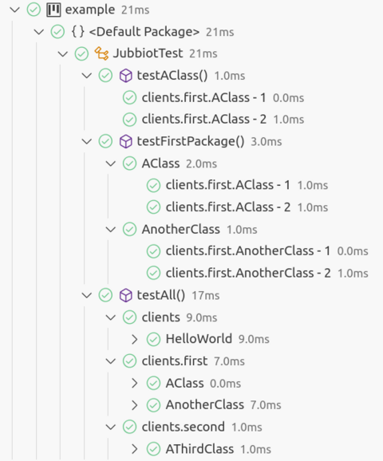
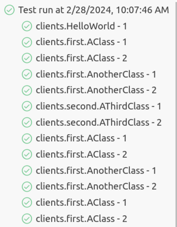

# JUnit Black Box I/O Testing

This library is mainly used for teaching purposes and provides a simple way to
test Java code without prescribing interfaces (as per standard *unit testing*),
but using *black box* based on *standard I/O*. The class is based on [JUnit
5](https://junit.org/junit5/) to allow an easy integration with IDEs and CI/CD
systems, but does not require any knowledge of JUnit to be used.

This is particularly useful for *object orientation* undergraduate classes where
deciding the architecture of code is usually part of the exercise assigned: in
such a situation *unit testing* (that relays on the presence of specific
classes, and methods with a specific signature) gives too much information to
the student (beside requiring some knowledge of non trivial tools like JUnit). 

On the other hand, *black box* testing can be easily designed so that tests
implementation amounts to completing some `main` methods that (possibly given
some *arguments on the command line* and some input on the *standard input*)
produce some prescribed output on the *standard output*. Such test are
considered successful if the *actual* output is (in some sense) equal to the
*expected* one.

## Example

An [example](example) project is provided to show the basic idea. 

Suppose that the **teacher** assignment is: "provide the code needed to add
integers and greet people", and that he decides to provide the following *black
box* tests by asking to implement the `main` methods of the following hierarchy
of classes:

```
src/main/java/clients
├── first
│   ├── AClass.java
│   └── AnotherClass.java
├── HelloWorld.java
└── second
    └── AThirdClass.java
```

(of which he can provide an empty skeleton) such that, in:

* `AClass` sum the integers passed as arguments on the command line,
* `AnotherClass` sum the integers read from standard input,
* `HelloWorld` greet the `world` (independently from any input), 
* `AThirdClass` sum the integers passed both as arguments on the command line
  and read from standard input.

To complete the specification of this task, the **teacher** provides some *test
cases* in a directory `tests` that mimics the structure of the `clients` one:

```
tests/clients
├── first
│   ├── AClass
│   │   ├── args-1.txt
│   │   ├── args-2.txt
│   │   ├── expected-1.txt
│   │   └── expected-2.txt
│   └── AnotherClass
│       ├── expected-1.txt
│       ├── expected-2.txt
│       ├── input-1.txt
│       └── input-2.txt
├── HelloWorld
│   └── expected-1.txt
└── second
    └── AThirdClass
        ├── args-1.txt
        ├── args-2.txt
        ├── expected-1.txt
        ├── expected-2.txt
        ├── input-1.txt
        └── input-2.txt
```

describing an hierarchy of classes whose `main` method must:

* `clients.first.AClass`
* `clients.first.AClass`
* `clients.first.AClass`
* `clients.first.AClass`

The **teacher** finally provides the `JubbiotTest` class (in the `src/test/java`
directory); for the purpose of showing how automatic test discovery works, the
class has three different JUnit `TestFactory` methods

```java
public class JubbiotTest {

  @TestFactory
  public List<? extends DynamicNode> testAClass() throws IOException {
    return new BlackBoxTestsGenerator("tests").generate("clients.first.AClass");
  }

  @TestFactory
  public List<? extends DynamicNode> testFirstPackage() throws IOException {
    return new BlackBoxTestsGenerator("tests").generate("clients.first");
  }

  @TestFactory
  public List<? extends DynamicNode> testAll() throws IOException {
    return new BlackBoxTestsGenerator("tests").generate();
  }
}
```

The first will collect *test cases* for the `clients.first.AClass` class, the
second for the classes in the `clients.first` package and its sub-packages, and
the third for all the classes related to *test cases* under the `tests`
directory. Test discovery is based on the presence of the file `expected-1.txt`
(given that arguments and input files are optional and there must be at least a
*test case*) in a directory mimicking the package/class structure.

At this point, the **student** can run can implement whatever code structure he
likes, in the given example, he realizes a `code` package with two utility

```
src/main/java/code/
├── Adder.java
└── Greeter.java
```

The **student** is completely free to choose how and where to put the code that
implements the required functionality. Once he has done that, it can fill-in the
code of the `main` methods of the skeleton classes in `src/main/java/clients`
directory and run the tests (by invoking `gradle test` as usual).

Using [Visual Studio Code](https://code.visualstudio.com/) as an example IDE,
code execution produces the following hierarchical output in the `TESTING`
sidebar:



and the following one in the `TEST RESULTS` output tab:



In case it is not easy for the **student** to grasp the reason of failed tests
(not present in this example), he can define the `GENERATE_ACTUAL_FILES`
*environment variable* to `true` and run the tests again. This will produce an
`actual-N.txt` file (in the same subdirectory of `tests` where the other test
case files are stored) containing the actual output produced by its
implementation of the `main` method for the class under test. By comparing the
`expected-N.txt` and `actual-N.txt` files, the **student** should easily
understand the reason of the failure.